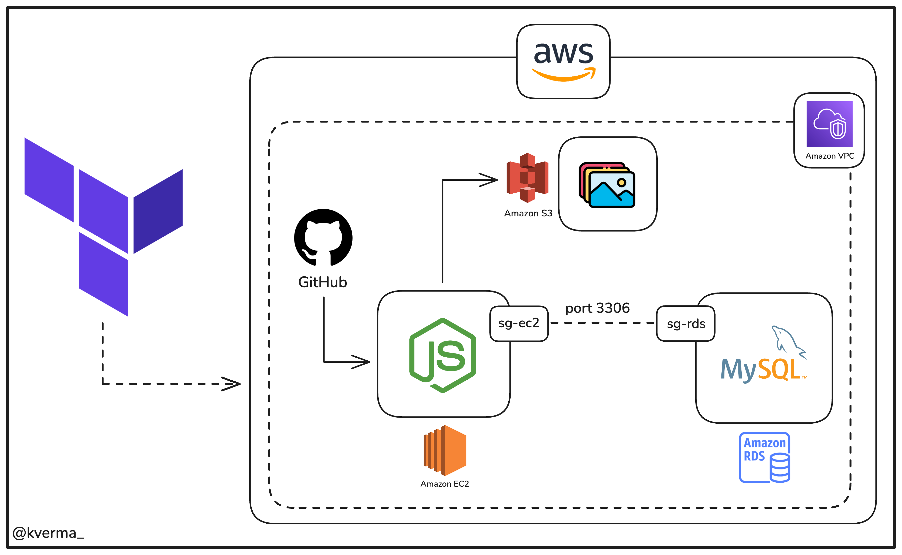
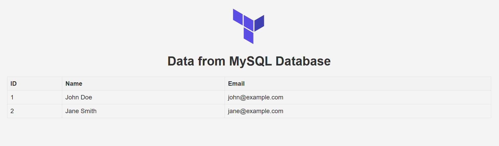

# ☁️ Terraform AWS Infrastructure for Node.js App

This project provisions AWS infrastructure using Terraform to deploy a Node.js backend application. It includes an EC2 instance running the Node.js app, an RDS MySQL database, and an S3 bucket for static assets. All resources are secured within a VPC.

---




## 🔐 AWS IAM User Setup & EC2 Key Pair

Before using Terraform to provision AWS resources, you'll need AWS credentials and a key pair for EC2 SSH access.

---

### 👤 1. Create an IAM User with Administrator Permissions

1. Go to the [AWS IAM Console](https://console.aws.amazon.com/iam/).
2. Click **Users** → **Add user**.
3. Choose a name, e.g., `terraform-user`.
4. Select **Access key - Programmatic access**.
5. Click **Next** → under Permissions, choose **Attach existing policies directly**.
6. Search for and attach the policy:  AdministratorAccess
7. Complete the process and **download the `.csv` file** with the access key and secret key.

You'll use these keys in your `~/.aws/credentials` file or pass them to Terraform as environment variables.

> ⚠️ Only use AdministratorAccess in development or testing. Use least-privilege roles in production.

---

### 🔑 2. Create an EC2 Key Pair for SSH Access

1. Go to the [EC2 Key Pairs Console](https://console.aws.amazon.com/ec2/v2/home?#KeyPairs).
2. Click **Create key pair**.
3. Choose a name like `moy-key`, and select file format:
- `.pem` for Linux/macOS
- `.ppk` for PuTTY on Windows

4. Click **Create key pair** and **download the `.pem` file**.

You'll reference this key in your Terraform EC2 configuration:

```hcl
key_name = "your-key"
```
And use it to connect to your EC2 instance:

```
ssh -i "your-key.pem" ec2-user@<EC2_PUBLIC_IP>
```
🔐 Keep your .pem file safe. Never upload it to GitHub!

# 📁 Sample AWS credentials file (~/.aws/credentials)
```
[your-iam-user]
aws_access_key_id = YOUR_ACCESS_KEY
aws_secret_access_key = YOUR_SECRET_KEY
```

Then your Terraform provider block should use this profile:
```
provider "aws" {
  region                  = "your-region"
  profile                 = "your-iam-user"
  shared_credentials_files = ["~/.aws/credentials"]
}
```

# 📦 S3 Bucket Setup
Stores static assets (e.g., images) uploaded via Terraform using aws_s3_object.

```
resource "aws_s3_bucket" "tf_s3_bucketmoy" {
  bucket = "bucket-name"

  tags = {
    Name        = "Nodejs terraform bucket"
    Environment = "Dev"
  }
}

resource "aws_s3_object" "tf_s3_objectmoy" {
  bucket = aws_s3_bucket.tf_s3_bucketmoy.bucket
  for_each = fileset("../public/images", "**")
  key    = "images/${each.key}"
  source = "../public/images/${each.key}"
}
```

## 🧱 EC2 & RDS Breakdown

### ✅ EC2: Hosting the Node.js Application

- **Purpose:** Runs your Node.js backend.
- **Provisioned With:** `aws_instance`
- **Security Group (`sg-ec2`):**
  - Allows:
    - SSH (port 22) from your IP
    - HTTP (port 80) from anywhere
    - MySQL (port 3306) access only from RDS SG

- **AMI:** Amazon Linux 2 or Ubuntu
- **User Data Script:** Installs Node.js, clones GitHub repo, installs dependencies, starts the app.

#### 🔹 EC2 Snippet (`ec2.tf`)
```hcl
resource "aws_instance" "nodejs_server" {
  ami           = "ami-0abcdef1234567890" # Replace with your region's AMI
  instance_type = "t2.micro"
  key_name      = "your-keypair-name"

  security_groups = [aws_security_group.sg-ec2.name]

  user_data = <<-EOF
              #!/bin/bash
              sudo yum update -y
              curl -sL https://rpm.nodesource.com/setup_18.x | sudo bash -
              sudo yum install -y nodejs git
              git clone https://github.com/yourusername/your-nodejs-repo.git
              cd your-nodejs-repo
              npm install
              npm start
              EOF

  tags = {
    Name = "Nodejs-EC2"
  }
}
```

### All this part is a configuration of the Nodejs application that will be installed into the ec2 server
```
resource "aws_security_group" "sg-ec2" {
  name        = "nodejs-ec2-sg"
  description = "Allow SSH, HTTP, and MySQL"
  vpc_id      = aws_vpc.main.id

  ingress {
    from_port   = 22
    to_port     = 22
    protocol    = "tcp"
    cidr_blocks = ["YOUR_PUBLIC_IP/32"]
  }

  ingress {
    from_port       = 3306
    to_port         = 3306
    protocol        = "tcp"
    security_groups = [aws_security_group.sg-rds.id]
  }

  ingress {
    from_port   = 80
    to_port     = 80
    protocol    = "tcp"
    cidr_blocks = ["0.0.0.0/0"]
  }

  egress {
    from_port   = 0
    to_port     = 0
    protocol    = "-1"
    cidr_blocks = ["0.0.0.0/0"]
  }
}
```

## ✅ RDS: MySQL Database
Purpose: Stores persistent data for the application.

Provisioned With: aws_db_instance

Security Group (sg-rds):

Allows MySQL traffic (port 3306) only from the EC2 security group.

🔹 RDS Snippet (rds.tf)

```
  resource "aws_db_instance" "mysql_db" {
  allocated_storage    = 20
  engine               = "mysql"
  engine_version       = "8.0"
  instance_class       = "db.t3.micro"
  name                 = "nodeappdb"
  username             = "admin"
  password             = "securepassword123"
  parameter_group_name = "default.mysql8.0"
  skip_final_snapshot  = true

  vpc_security_group_ids = [aws_security_group.sg-rds.id]

  tags = {
    Name = "Nodejs-MySQL-RDS"
  }
}
```

## 🔹 Security Group (sg-rds)

```
resource "aws_security_group" "sg-rds" {
  name        = "mysql-rds-sg"
  description = "Allow MySQL access from EC2"
  vpc_id      = aws_vpc.main.id

  ingress {
    from_port       = 3306
    to_port         = 3306
    protocol        = "tcp"
    security_groups = [aws_security_group.sg-ec2.id]
  }

  egress {
    from_port   = 0
    to_port     = 0
    protocol    = "-1"
    cidr_blocks = ["0.0.0.0/0"]
  }
}
```
# 🔐 How to Connect to the EC2 Instance
When applying terraform apply, at the end it will show you an output with the command conection to the EC2 instance.

Connect using SSH:
```
ssh -i "path/to/your-keypair.pem" ec2-user@<EC2_PUBLIC_IP>
```

# 💡 Environment Configuration Inside EC2
The user_data block handles:

OS updates

Installing Node.js and Git

Cloning the app from GitHub

Installing dependencies via npm install

Running the app with npm start

Optional Enhancements
Use PM2 for better process management.

Add environment variables using .env or EC2 metadata.

Set up Nginx as a reverse proxy for production environments.

## 🗃️ Creating the MySQL Database and Table in RDS

Once your EC2 instance is up and running and connected to the RDS MySQL database, you can manually create your database, tables, and seed data.

### ✅ Step 1: Connect from EC2 to RDS

Use the MySQL client from your EC2 instance to connect to the RDS instance:

```bash
mysql -h <rds-endpoint> -u admin -p
```
Replace <rds-endpoint> with the endpoint of your RDS instance (shown in the AWS Console or Terraform output). Enter the password when prompted.

## ✅ Step 2: Run SQL Commands
Once connected, execute the following SQL commands to set up your database and seed it with sample data:
```
CREATE DATABASE tf_demo;

USE tf_demo;

CREATE TABLE users (
    id INT AUTO_INCREMENT PRIMARY KEY,
    name VARCHAR(100) NOT NULL,
    email VARCHAR(100) NOT NULL
);

INSERT INTO users (name, email) VALUES ('John Doe', 'john@example.com');
INSERT INTO users (name, email) VALUES ('Jane Smith', 'jane@example.com');
```

## ✅ You now have a users table with two sample entries, and your application can connect to this database to read or write user data


# 🚀 Deploy Instructions

```
terraform init
terraform plan
terraform apply
```

Those are the terraform commands that you need to use.

# Execute applications

Finally you only need to run this command on the ec2 command:
```
npm start
```
and with the port 3000

```
http://<IP_PUBLICA_DE_TU_INSTANCIA>:3000
```
And thats all



